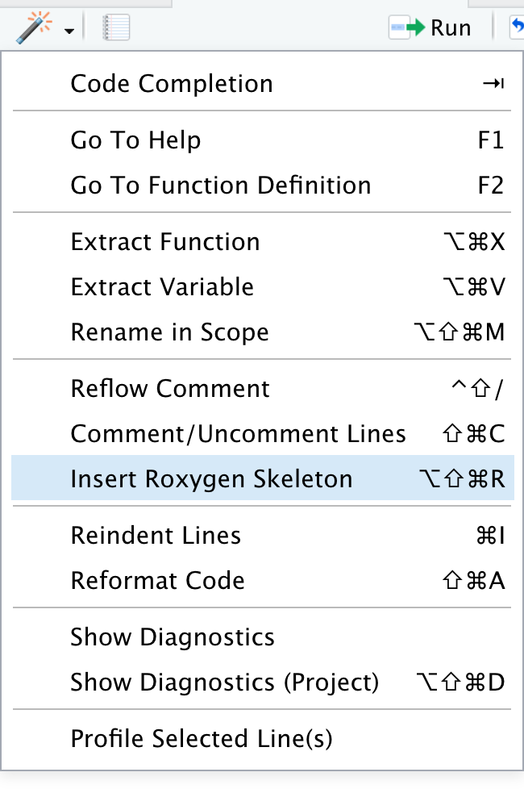
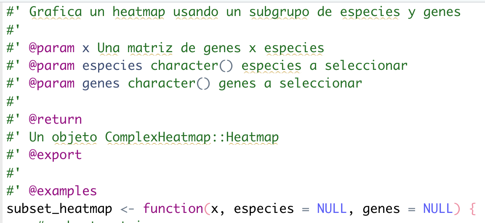
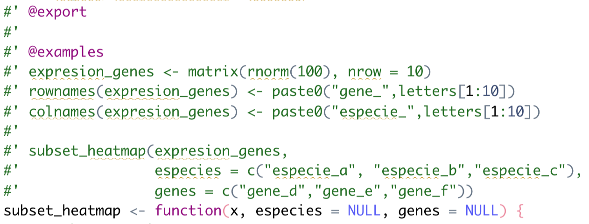
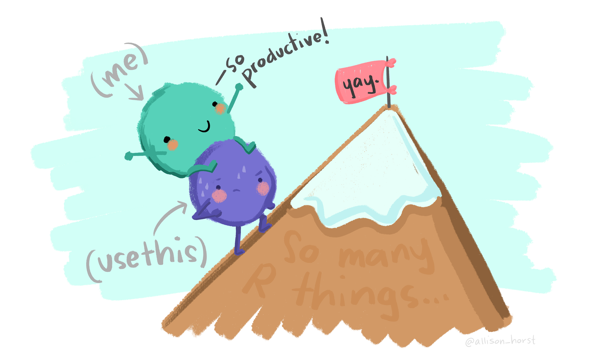

class: middle, center

## Este material posee una licencia tipo Creative Commons Attribution-ShareAlike 4.0 International License. 
## Para conocer más sobre esta licencia, visite http://creativecommons.org/licenses/by-sa/4.0/

---
class: middle, center

## Material disponible en: 
### https://github.com/EveliaCoss/ViernesBioinfo2024_parte2

## Basado en 
["R packages" by Hadley Wickham](https://r-pkgs.org)

["Building Tidy Tools" by Charlotte and Hadley Wickham](https://github.com/hadley/tidy-tools)

---
class: chapter-slide

# Los primeros pasos

---
```{r xaringanExtra-clipboard, echo=FALSE}
# No quitar! Es para que aparezca la opción copy code en los R chunks
xaringanExtra::use_clipboard()
```

## Revisar si podemos usar el nombre del paquete

```{r, eval=FALSE}
available::available("mipaquete")
```

## Crear la estructura inicial del paquete

```{r, eval=FALSE}
usethis::create_package("mipaquete")
```

## Podemos agregar la estructura de biocthis

```{r, eval=FALSE}
biocthis::use_bioc_pkg_templates()
```

---
## Pedir que Git ignore el archivo .Rproj

```{r, eval=FALSE}
usethis::use_git_ignore("*.Rproj")
```

## Crear el respositorio de GitHub

```{r, eval=FALSE}
usethis::use_github()
```

## Crear el archivo Description estilo Bioconductor

```{r, eval=FALSE}
biocthis::use_bioc_description()
```

---
## Crear el archivo README estilo Bioconductor

```{r, eval=FALSE}
biocthis::use_bioc_readme_rmd()

devtools::build_readme()
```

Recuerda guardar los cambios, hacer commit y push.

---
## Crear el archivo NEWS estilo Bioconductor

```{r, eval=FALSE}
biocthis::use_bioc_news_md()
```

## Crear los archivos de ayuda para usuarios y contribuidores

```{r, eval=FALSE}
biocthis::use_bioc_coc()
usethis::use_tidy_contributing()
biocthis::use_bioc_support()
biocthis::use_bioc_issue_template()
biocthis::use_bioc_citation()
```

---
class: chapter-slide

# Buenas prácticas para escribir funciones

---
# Nombre de la función

- Cortos pero descriptivos
- Recomendable: Separar las palabras con _
- Establecer una palabra en común al inicio para familias de funciones

```{r, eval=FALSE}
use_bioc_citation() # es mejor que

citation()
bioc_cit()
usebioccitation()
useBiocCitation()
use.bioc.citation()
```

---
# Estructura de la función

- Indentar las líneas de código.
- Agregar comentarios para separar/describir las secciones importantes.
- Usar la sintaxis paquete::funcion() cuando hacemos llamado a funciones de otros paquetes.

```{r, eval=FALSE}
usethis::use_r("subset_heatmap")
```

---
Generemos el código de manera regular.

Simulemos una matriz con diversas mediciones y grafiquemos los datos en un heatmap.

```{r, eval=FALSE}
mi_matriz <- matrix(rnorm(100), nrow = 10)
rownames(mi_matriz) <- paste0("medicion_",letters[1:10])
colnames(mi_matriz) <- paste0("grupo_",letters[1:10])

library(ComplexHeatmap)

Heatmap(mi_matriz,
        cluster_columns = FALSE,
        heatmap_legend_param = list(title = "valores"))
```

---
```{r, echo=FALSE, message=FALSE, error=FALSE, fig.align='center'}
mi_matriz <- matrix(rnorm(100), nrow = 10)
rownames(mi_matriz) <- paste0("medicion_",letters[1:10])
colnames(mi_matriz) <- paste0("grupo_",letters[1:10])

library(ComplexHeatmap)

Heatmap(mi_matriz,
        cluster_columns = FALSE,
        heatmap_legend_param = list(title = "valores"))
```

---
Escribamos una función que permita seleccionar algunos grupos de interés y genere el heatmap.

```{r, eval=FALSE}
library(ComplexHeatmap)

subset_heatmap <- function(x,mediciones=NULL,grupos=NULL) {
x_subset <- x[mediciones,grupos]
Heatmap(mi_matriz,
        cluster_columns=FALSE,
        heatmap_legend_param=list(title="valores"))
}
```

No la mejor opción

---
Un poco mejor

```{r, eval=FALSE}
library(ComplexHeatmap)
subset_heatmap <- function(x, mediciones = NULL, 
                           grupos = NULL) {
    x_subset <- x[mediciones,grupos]
    Heatmap(mi_matriz,
            cluster_columns = FALSE,
            heatmap_legend_param = list(title = "valores"))
}
```

---
Mucho mejor

```{r, eval=FALSE}
subset_heatmap <- function(x, mediciones = NULL, 
                           grupos = NULL) {
    # subset matrix
    x_subset <- x[mediciones, grupos]
    
    # plot heatmap
    ComplexHeatmap::Heatmap(
      x_subset,
      cluster_columns = FALSE,
      heatmap_legend_param = list(title = "valores"))
}

subset_heatmap(
  mi_matriz,
  mediciones = c("medicion_a", "medicion_b", "medicion_c"),
  grupos = c("grupo_d","grupo_e","grupo_f"))
```

---
¡Tu turno!

Escribe una función que: 

- Filtre la matriz y mantenga sólo los valores por encima de cierto valor.
- Genere el heatmap filtrado.

Recuerda seguir las recomendaciones para escribir funciones.

---
class: chapter-slide

# Documentación

---
# Documentación

.pull-left[
- Descripción de los argumentos/parámetros.
- Ejemplos reproducibles.

Usaremos el paquete roxygen2

- Coloca el cursor dentro de la función.
- Usa la varita mágica para crear el esqueleto de documentación de roxygen.
]

.pull-right[
```{r, echo=FALSE, out.width='60%', fig.align='center'}

```
]

---
Llena los campos de la documentación:

- Para cada argumento/parámetro se debe agregar la descripción. Por ejemplo, el tipo de objeto que esperas que el usuario introduzca.
- Describe lo que hace tu función.
- Indica qué tipo de salida tendrá la función.

```{r, echo=FALSE, out.width='65%', fig.align='center'}

```

---
Agrega un ejemplo sencillo y reproducible

```{r, echo=FALSE, out.width='70%', fig.align='center'}

```

---

Una vez que terminamos de escribir la documentación, generamos el archivo de ayuda.

```{r, eval=FALSE}
devtools::document()
```

Construye el paquete, después reinicia la sesión y carga tu paquete. 

```{r, eval=FALSE}
devtools::build()
```

Esto nos permitirá consultar la ayuda de la función usando:

```{r, eval=FALSE}
help(subset_heatmap)
?subset_heatmap
```

---
¡Tu turno!

- Genera la documentación de la función que creaste para filtrar la matriz y graficar un heatmap.

- Comprueba que se pueda consultar la ayuda de tu función.

---
class: chapter-slide

# Archivos de prueba

---
# Archivos de prueba

¿Para qué nos sirven los archivos de prueba?

- Estar seguros que la función tiene el comportamiento deseado.
- Verificar que la función es capaz de detectar las entradas correctas y reaccionar ante las entradas incorrectas.
- Verificar que la salida de la función es la esperada.
- Detectar fácilmente cuando una actualización interna o externa rompe nuestro código.

---
Vamos a utilizar la función subset_heatmap.

Ahora hagamos el archivo de pruebas.

```{r, eval=FALSE}
usethis::use_testthat()

usethis::use_test("subset_heatmap")

usethis::use_coverage()
```

---
Pensemos en formas de romper nuestra función:

- ¿Qué pasa si le damos como entrada un data frame?
- ¿Qué pasa si solamente le damos como entrada las mediciones y no los grupos?
- ¿Qué pasa si el vector de mediciones o grupos es numérico en lugar de caracter?

---
## Escribamos algunas pruebas:

```{r, eval=FALSE}
mi_matriz <- matrix(rnorm(100), nrow = 10)

rownames(mi_matriz) <- paste0("medicion_",letters[1:10])

colnames(mi_matriz) <- paste0("grupo_",letters[1:10])

test_that("Output is a ComplexHeatmap", {
    resultado <- subset_heatmap(
      mi_matriz,
      grupos = c("grupo_a", "grupo_b", "grupo_c"),
      mediciones = c("medicion_d", "medicion_e","medicion_f"))
    
    expect_s4_class(resultado, "Heatmap")
})
```

---
Evalúa la prueba usando 

```{r, eval=FALSE}
testthat::test_file("tests/testthat/test-subset_heatmap.R")
```

---
## Siguiente prueba


```{r, eval=FALSE}
test_that("Empty argument grupos are detected",{
    expect_error(subset_heatmap(mi_matriz,
                 grupos = c("grupo_a", "grupo_b","grupo_c")))
})
```

--
Una más:

```{r, eval=FALSE}
test_that("Error with data frame works",{
    expect_error(subset_heatmap(as.data.frame(mi_matriz)) )
})
```

---
Modifiquemos la función para poder detectar errores

```{r, eval=FALSE}
subset_heatmap <- function(x, grupos = NULL, 
                           mediciones = NULL) {
    # evalate class of x
    stopifnot("x must be a matrix" = inherits(x, "matrix"))

    # subset matrix
    x_subset <- x[mediciones, grupos]

    # plot heatmap
    ComplexHeatmap::Heatmap(
      x_subset,
      cluster_columns = FALSE,
      heatmap_legend_param = list(title = "valores"))
}
```

---
Vuelve a correr el test:

```{r, eval=FALSE}
testthat::test_file("tests/testthat/test-subset_heatmap.R")
```

---
class: chapter-slide

# Viñetas

---
# Cómo crear una viñeta?

- Debe mostrar un flujo de análisis explotando el potencial de tu paquete.
- Implementa tantas funciones de tu paquete como sea posible, pero no es necesario que incluya todas.
- Los datos a usar deben ser pequeños o fáciles de acceder. 
- Puedes crear múltiples viñetas para mostrar diferentes casos de análisis y cubrir una mayor cantidad de funciones.


```{r, eval=FALSE}
biocthis::use_bioc_vignette(
  name = "introduccion_a_mipaquete",
  title = "Introduccion a mipaquete")
```

---
class: chapter-slide

# Creado paquetes de forma colaborativa

---
# Agregando colaboradores al repositorio

.pull-left[
- Ve al repositorio de tu paquete.

- Entra a settings > collaborators > Add people

- Agrega el nombre de usuario de tu colaborador.

- Tu colaborador debe aceptar la invitación que le llegará por correo electrónico.
]

.pull-right[
```{r, echo=FALSE, out.width='100%', fig.align='center'}

```
]

---
¡Tu turno!

- Agrega un colaborador al repositorio de tu paquete.

- Pídele que agregue un archivo de pruebas/test para la función que creaste (filtra la matriz con valores mayores al que provee el usuario).

- Verifica que los cambios se ven reflejados en tu repositorio.

- Cambien de rol y agrega una nueva función al repositorio de tu colega.

---

.pull-left[<br><br><br><br><br><br><br>
.center[
# ¡Gracias! 
]
]

.pull-right[<br><br><br><br>
```{r, echo=FALSE, out.width='120%', fig.align='center'}

```

]


